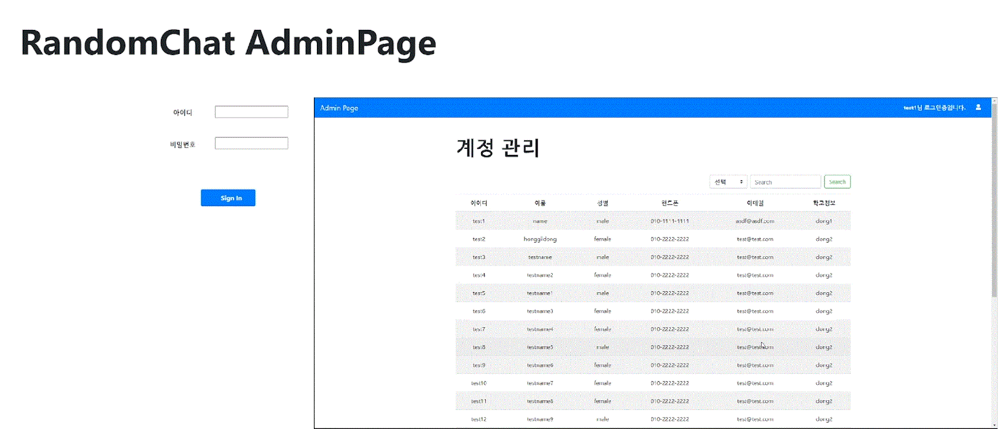
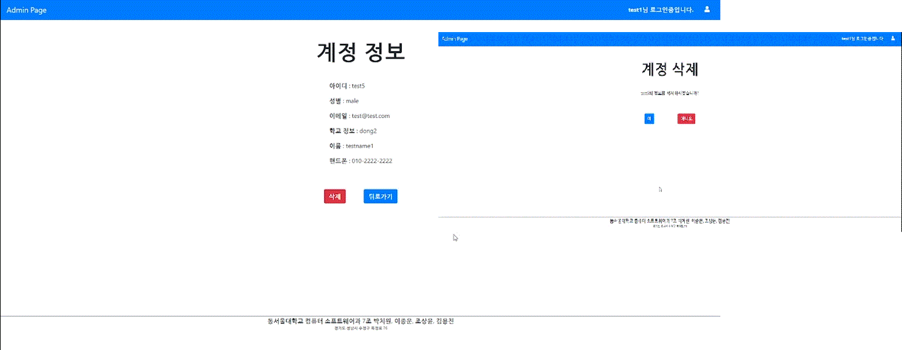
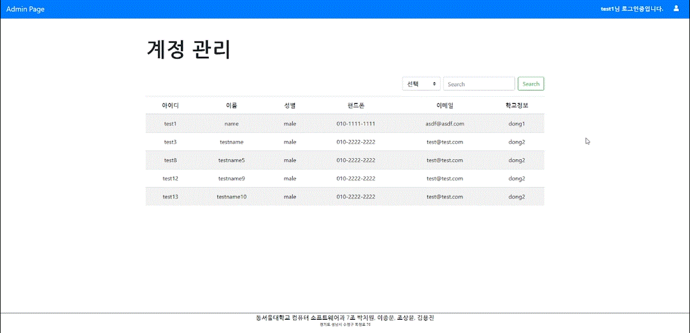
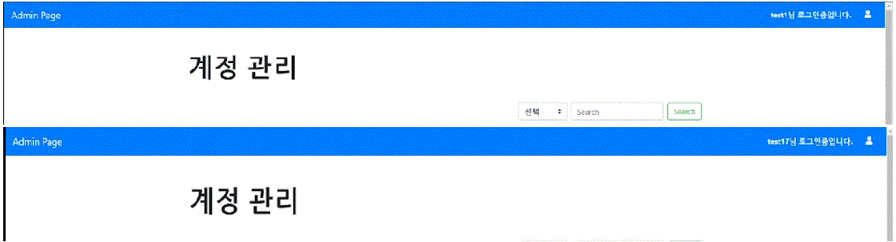

# 대학 졸업작품 (웹)
# Graduated_Work_Admin_Page_Web
## 사용 언어(프레임워크) : HTML, BootStrap, Spring Boot, H2 DataBase, Mybatis, Thymeleaf
## 사용 프로그램(OS) : Linux(Db Server,Web Server), Window10(Develope), git, VisualStudio Code, JDK, Chrome
# 개발자(이메일)
### 박치원(iptablecommandcode@gmail.com)
### 이종운(dlwhddns5614@gmail.com)
### 조상윤(chsyoon411@gmail.com)
### 김용진(sangsoos9085@gmail.com)

안드로이드 채팅어플과 같은 db를 사용하는 관리자 웹 페이지

### 메인 홈페이지 사진과 로그인시 보이는 화면

### 계정의 상세 정보를 접근 관람과 계정 삭제가 가능한 화면

### 검색 결과로 필요한 정보를 검색할 수 있게 하는 화면

### 다른 계정으로 로그인시 서로 다른 계정으로 접속한 결과가 보이는 화면

